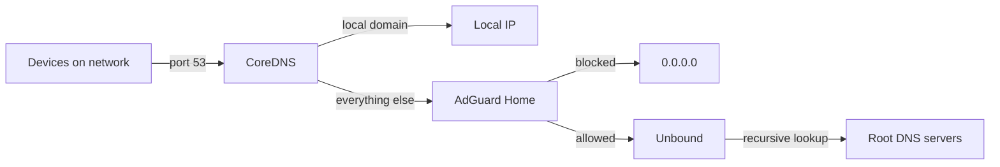
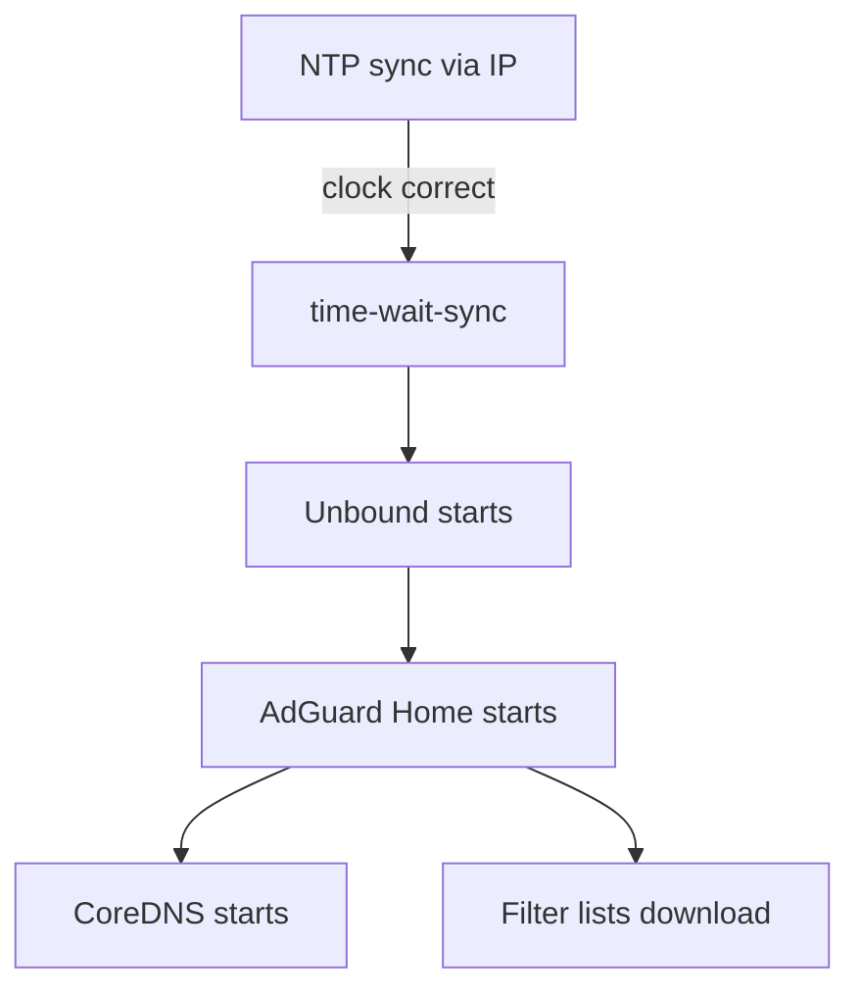

# pi-dns-stack

Network-wide ad blocking and local DNS for the home network, running on Raspberry Pi devices with NixOS. Two Pi Zero 2 W nodes (`dns1`, `dns2`) handle DNS exclusively; a third Pi 4 node (`kitchen-music`) also runs Music Assistant with a HiFiBerry Amp4 for whole-home audio.

## Making it yours

One-time setup:

```sh
make init
```

That copies `config.example.nix` → `config.local.nix`, registers it with `git add -N` (so Nix flakes can see the path while keeping the content local-only), and installs a pre-commit hook that refuses to ever commit it. Then edit `config.local.nix` with your local domain, IP, SSH key, and timezone.

You may also want to edit:

| File | What to change |
|------|---------------|
| `modules/adguardhome.nix` | Filter lists and whitelist rules |
| `hosts/dns1.nix`, `hosts/dns2.nix`, `hosts/kitchen-music.nix` | Hostnames for your nodes |
| `flake.nix` | Add or remove nodes |

Everything else should work out of the box on a Pi Zero 2 W with a Waveshare PoE/ETH/USB HAT.

## Why

The homelab runs on a single server with services behind local domains. AdGuard Home on Home Assistant handled DNS and ad blocking — until the internet went down. Without a connection, AdGuard couldn't resolve local domains either, taking the entire homelab offline. Home Assistant, dashboards, cameras — all gone because DNS died.

The fix: dedicated DNS hardware that keeps local resolution working regardless of internet status. CoreDNS handles local domains independently, so they always resolve even when the upstream connection is down. Ad blocking and recursive DNS are separate layers that degrade gracefully.

Raspberry Pi Zero 2 Ws are cheap (~$15), and paired with the Waveshare PoE/ETH/USB HAT, each node gets power and ethernet from a single cable — no power supplies, no WiFi dependencies. NixOS makes the whole stack declarative and reproducible: one `make build && make flash` and a fresh node is ready.

## How it works

Every DNS query on the network flows through three layers:



**CoreDNS** handles incoming queries. Local domains get routed to the homelab server. Everything else goes to AdGuard Home.

**AdGuard Home** filters queries against blocklists covering ads, tracking, smart TV telemetry, and annoyances. Blocked domains return `0.0.0.0`. Clean queries pass through to Unbound.

**Unbound** is a recursive resolver — it talks directly to root DNS servers instead of forwarding to Google/Cloudflare. This means DNS lookups never leave your control.

## Boot sequence

The Pi Zero 2 W has no real-time clock, so the boot order matters:



NTP servers are configured by IP address to avoid a chicken-and-egg problem — you need DNS to resolve NTP hostnames, but you need correct time for DNSSEC validation.

## Hardware

- **dns1, dns2** — Raspberry Pi Zero 2 W (512MB RAM, quad-core ARM) + Waveshare PoE/ETH/USB HUB HAT for ethernet + power-over-ethernet. Runs entirely from an SD card with tmpfs for logs (no SD card wear).
- **kitchen-music** — Raspberry Pi 4 + HiFiBerry Amp4. Runs the same DNS stack plus Music Assistant; persistent state (MA library/config) lives on the SD card.

## Project structure

```
flake.nix                       # Defines dns1, dns2, kitchen-music nodes
config.example.nix              # Example config (copy to config.local.nix)
hosts/
  dns1.nix                      # Pi Zero 2 W + DNS
  dns2.nix                      # Pi Zero 2 W + DNS
  kitchen-music.nix             # Pi 4 + HiFiBerry Amp4 + DNS + Spotify + AirPlay
modules/
  base.nix                      # Universal host config (SSH, NTP, users, sudo, journald, tmpfs)
  hardware/
    pi-zero2w.nix               # Pi Zero 2 W (pulls in base.nix transitively)
    pi4.nix                     # Pi 4 (pulls in base.nix transitively)
    hifiberry-amp4.nix          # HAT add-on: pre-merged DTB, ALSA modules, asound default
    _shared/
      rpi-base.nix              # Internal: shared rpi boot scaffolding
  dns/
    default.nix                 # Barrel: composes the trio + nameservers + DNS firewall
    coredns.nix                   # Frontend DNS + local domains (port 53)
    adguardhome.nix               # Ad blocking + filter lists (port 5353)
    unbound.nix                   # Recursive DNS resolver (port 5335)
  observability.nix             # Prometheus node_exporter (system + per-service health)
docs/
  home-assistant-prometheus.md  # End-to-end recipe for surfacing metrics in HA
  audio/
    spotify-connect.nix         # spotifyd (Spotify Connect endpoint)
    airplay.nix                 # shairport-sync (AirPlay receiver)
scripts/
  setup.sh                      # Create OrbStack build VM + install Nix
  build.sh                      # Build SD card image
  flash.sh                      # Flash image to SD card (with safety checks)
  deploy.sh                     # Push config to a running node over SSH (no reflash)
  test.sh                       # Run health checks against a node
Makefile                        # Convenience wrapper
```

Hosts compose modules like recipes — `kitchen-music.nix` is just an `imports` list pulling from `base`, `hardware/`, `dns/`, and `audio/`. Adding a future `bedroom-music` is "copy kitchen-music.nix, change hostname, done".

## Usage

### First time setup

```sh
cp config.example.nix config.nix  # edit with your details
make setup                        # create OrbStack build VM
```

### Build and flash

```sh
make build HOST=dns1
make flash HOST=dns1
```

Insert the SD card, power on the Pi, and it should appear on the network within a minute or two.

### Test a node

```sh
make test IP=192.168.x.x
```

### SSH access

```sh
ssh <user>@<ip>
```

Password auth is disabled — SSH key only.

## Memory budget

With 512MB RAM and `gpu_mem=16`, roughly 450MB is available:

| Service     | Limit  |
|-------------|--------|
| Unbound     | 128 MB |
| AdGuard Home| 128 MB |
| CoreDNS     |  64 MB |
| OS + system | ~130 MB|

All services restart automatically if they crash.
